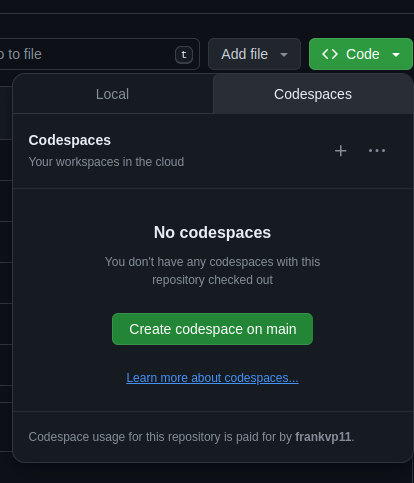

**Project Description**

This repository serves as an example implementation of the design that I have shown for my final exam.  


This implementation is not an exact replica of the design, but it is a good representation of the design.  


So, I would encourage you to not take this implementation as the "ground truth" for my project, but rather use it  to experiment and see how the design works, thinking about the personas of Tim, Abi and Pat. 


**How to Run**


To run this, simply press on the codespaces tab, then run it in a codespace




The only package that you need to install to run this project is nicegui. So, in the terminal run 
```
pip install nicegui
```

Then, run the project by running the main.py file.
  
```
python main.py
```


